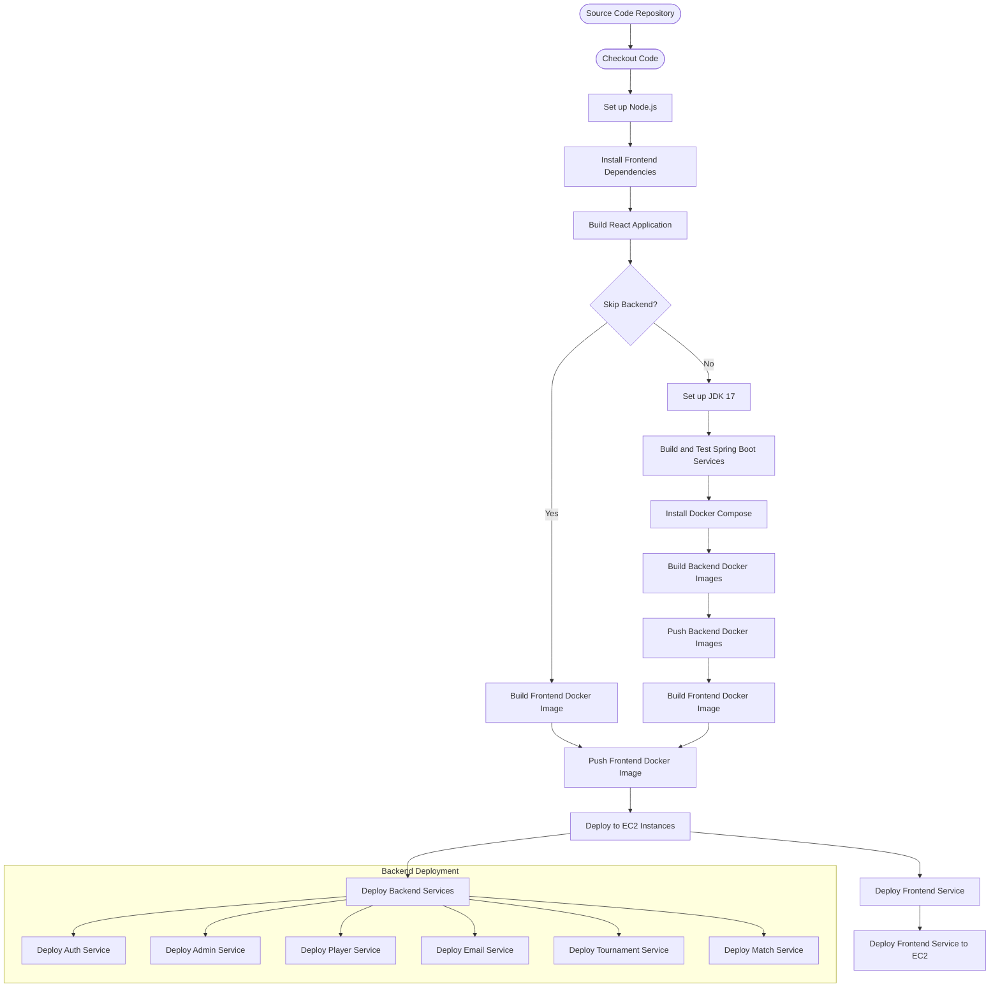

# MyChess - Chess Tournament Management System


## Table of Contents
- [Overview](#overview)
- [Features](#features)
- [Microservices](#microservices)
- [Tech Stack](#tech-stack)
- [Deployment](#deployment)
- [Running Locally](#running-locally)
- [License](#license)
## Overview
**MyChess** is a web application for organizing and participating in chess tournaments. It allows players to join tournaments, track progress, and calculate ratings using the **Glicko-2** system. Built using a microservices architecture, the app offers independent services for handling key functionalities such as player management, tournaments, and authentication.
## Features
- **Player Authentication**: Secure login and registration using **JWT tokens**.
- **Tournament Management**: Create and join customizable chess tournaments.
- **Matchmaking**: Automatic pairing of players in tournaments.
- **Glicko-2 Rating System**: Real-time rating updates after matches.
- **Admin Panel**: Admin features for managing users, including blacklisting and whitelisting.
- **Email Notifications**: Automated notifications for account verification and status updates.
## Microservices
- **Auth Service**: Manages user authentication and JWT issuance.
- **Match Service**: Handles match results and rating calculations.
- **Tournament Service**: Manages tournament creation and participation.
- **Player Service**: Manages player profiles and ratings.
- **Admin Service**: Admin functionality for blacklisting/whitelisting players.
- **Email Service**: Sends account verification and notification emails.
## Tech Stack
- **Backend**:
    - [Java](https://www.java.com)
    - [Spring Boot](https://spring.io/projects/spring-boot)
- **Frontend**:
    - [React](https://reactjs.org)
- **Database**:
    - [MySQL](https://www.mysql.com)
- **Containerization**:
    - [Docker](https://www.docker.com)
- **CI/CD**:
    - [GitHub Actions](https://github.com/features/actions)
## Deployment
The app runs on AWS EC2, with each microservice containerized using Docker. CI/CD is handled via GitHub Actions, automating the build, testing, and deployment process.
- **AWS EC2**: Services are deployed on EC2 instances behind an Elastic Load Balancer.
- **Docker**: All microservices are containerized.
- **GitHub Actions**: Automates testing, building, and pushing Docker images to production.

# Running Locally

## Environment Variables
## Environment Variables Setup

Before running the application, you need to create a `.env` file and add it to the root directory of each microservice (e.g. auth-service, player-service)

   ```env
   # Local MySQL Database URLs
   LOCAL_AUTH_SERVICE_MYSQL_URL=jdbc:mysql://localhost:3306/auth_service_db
   LOCAL_AUTH_SERVICE_MYSQL_USER=<your_mysql_user>
   LOCAL_AUTH_SERVICE_MYSQL_PASSWORD=<your_mysql_password>
   LOCAL_PLAYER_SERVICE_MYSQL_URL=jdbc:mysql://localhost:3306/player_service_db
   LOCAL_PLAYER_SERVICE_MYSQL_USER=<your_mysql_user>
   LOCAL_PLAYER_SERVICE_MYSQL_PASSWORD=<your_mysql_password>
   LOCAL_MATCH_SERVICE_MYSQL_URL=jdbc:mysql://localhost:3306/match_service_db
   LOCAL_MATCH_SERVICE_MYSQL_USER=<your_mysql_user>
   LOCAL_MATCH_SERVICE_MYSQL_PASSWORD=<your_mysql_password>
   LOCAL_TOURNAMENT_SERVICE_MYSQL_URL=jdbc:mysql://localhost:3306/tournament_service_db
   LOCAL_TOURNAMENT_SERVICE_MYSQL_USER=<your_mysql_user>
   LOCAL_TOURNAMENT_SERVICE_MYSQL_PASSWORD=<your_mysql_password>
   LOCAL_ADMIN_SERVICE_MYSQL_URL=jdbc:mysql://localhost:3306/admin_service_db
   LOCAL_ADMIN_SERVICE_MYSQL_USER=<your_mysql_user>
   LOCAL_ADMIN_SERVICE_MYSQL_PASSWORD=<your_mysql_password>
   LOCAL_EMAIL_SERVICE_MYSQL_URL=jdbc:mysql://localhost:3306/email_service_db
   LOCAL_EMAIL_SERVICE_MYSQL_USER=<your_mysql_user>
   LOCAL_EMAIL_SERVICE_MYSQL_PASSWORD=<your_mysql_password>
   
   # JWT Secret Key
   JWT_SECRET=<your_base64_encoded_secret_key>

   # Email Service Configuration
   EMAIL_USERNAME=<your_email_username>
   EMAIL_PASSWORD=<your_email_password>

   # Hibernate Dialect
   SPRING_JPA_HIBERNATE_DIALECT=org.hibernate.dialect.MySQLDialect
   ```
Ensure that you have the mysql databases set up on your local machine.

## Backend Setup

## Backend Microservices

1. Navigate to each microservice directory:
   ```bash
   cd <microservice-name>  # Replace <microservice-name> with admin-service, player-service, email-service, tournament-service, match-service, auth-service
   ```

2. Run the Spring Boot application:
   ```bash
   mvn spring-boot:run
   ```
   
## Frontend Setup

1. Navigate to the frontend directory:
   ```bash
   cd frontend
   ```

2. Install dependencies:
   ```bash
   npm install
   ```

4. Start the frontend:
   ```bash
   npm start
   ```

5. Open your browser and visit:
   ```
   http://localhost:3000
   ```
   
## License
This project is licensed under the **GNU General Public License v3.0**. You are free to modify, distribute, and use this project as long as the same license applies to any derivative work.
For more details, see the [LICENSE](LICENSE) file.
[GNU General Public License v3.0](https://www.gnu.org/licenses/gpl-3.0.en.html)
